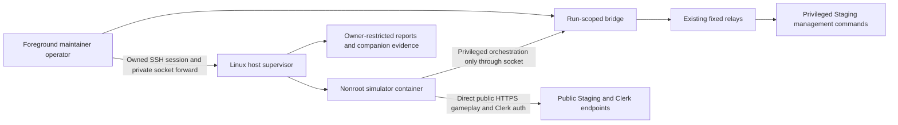

# External US simulation host

Issue: [#228](https://github.com/TailTag-Game/tailtag/issues/228).
Acceptance source: the [approved refinement comment](https://github.com/TailTag-Game/tailtag/issues/228#issuecomment-6072384020), also saved locally in `.refinement/228.md`.

**Status: approved by the maintainer on 2026-10-08; implementation authorized.**

## Acceptance follow-up — 2026-10-09

This checkpoint supersedes the original host selection and earlier phase status below; those remain historical design and local implementation evidence. The maintainer-approved provisioned override is **DigitalOcean RIC1 v5, 2 vCPU, 4 GiB RAM, 30 GiB disk, US$0.052/hour, with a US$40/month before-tax operating budget**, on `linux/amd64`. Plan class, transfer allowance and billing ownership are not established by this override; keep verified provider inventory private.

Native Ubuntu bootstrap and exact host-run recovery are proven. A twenty-identity pool authentication smoke passed on the local Mac. Full normal DigitalOcean five-minute acceptance and the separate manual-stop proof remain pending; neither the smoke nor recovered failed attempts establishes normal-run PASS.

The acceptance repair generates `AllowTcpForwarding remote` plus `PermitListen none`, preserving remote-only Unix forwarding, mask 0177, no unlink, no agent forwarding, no tunnel and TTY access. Independent real Ubuntu 24.04/OpenSSH 9.6 evidence must prove Unix round trip and remote/local TCP refusal. Administrative bootstrap runs as root through the trusted provider console; the dedicated `tailtag_sim` owner has no sudo and uses ordinary SSH for transfers/runtime/recovery.

The normal profile sets `configuration.limits.attempts=9000`, a per-request execution attempt budget. Ten active actors does not mean ten requests per second. The separate safety policy retains 10,000 execution attempts. Fixture-renewal/terminal recovery corrections are a separate bounded implementation unit; existing pinned identity, single-attempt mutations, sticky target veto and honest uncertain recovery remain required. No new provisioning, deployment, paid resources or live workload is authorized by this local follow-up.

Completed locally: acceptance-repair implementation, `make sim-check` (formatting, lint, strict types, catalog, Bash syntax, tests and Semgrep), and independent unit/whole-change review. Pending: hosted PR CI/review gates and separately authorized remaining normal-run/manual-stop acceptance proofs. Reversibility: local changes TWO-WAY DOOR.

## Original routing and phase ledger — 2026-10-08

Execution: ADW STANDARD EXPANDED.
Assurance: SECURITY, DATA INTEGRITY, RELIABILITY.

Completed:

- Approved refinement decisions G1–G9; DigitalOcean NYC3 selected.
- Independent repository exploration and exact convention operation inventory.
- Current issue/comment verified against the local acceptance contract.
- Focused branch `feat/external-simulator-host-228`, based on `9eecb7a`.
- Fresh baseline `make sim-check`: 1,115 tests, catalog, formatting, lint, strict types and Semgrep passed.
- Independent Astra security design challenge: acceptable when the authorization, mutation-settlement and supervision constraints below are frozen. No new product/scope decision required.

Current: approved design and test surface; implementation planning and execution.

Pending: implementation plan; independent Test Author → Implementer → Reviewer per unit; deterministic and targeted assurance gates; whole-change review; offline host/container proof; separately authorized provisioning and live proof.

Environment: simulator toolchain and existing Docker engine are ready. The daemon was unavailable during design checks and became available before implementation; this task did not start it. Clean up only task-owned resources. No external host or live Staging work has been started.

## Scope guard

Outcome: a repository-owned, bounded operator workflow that runs convention-v2 simulation in a version-identifiable container on one DigitalOcean US host, with direct public gameplay traffic and a temporary maintainer-side privileged bridge.

Non-goals: gameplay/API/schema changes; new scenario semantics or report schema; unattended scheduling; automated backend-resource monitoring; Production/Development load; a generic RPC platform; a database proxy; stored platform/Clerk credentials on the VPS; registry publication or infrastructure orchestration migration.

Expected production files:

- `tools/simulator/tailtag_simulator/host_protocol.py`: closed wire/launch policy and session authorization.
- `tools/simulator/tailtag_simulator/host_bridge.py`: maintainer-side socket service and fixed existing-relay dispatch.
- `tools/simulator/tailtag_simulator/host_channel.py`: container-side launcher-compatible socket transport.
- `tools/simulator/tailtag_simulator/host_operator.py`: foreground maintainer orchestration of trusted session state and owned SSH process.
- `tools/simulator/tailtag_simulator/host_runner.py`: Linux host supervision, exclusive run admission and durable artifact handling.
- Targeted changes to `__main__.py`, `provenance.py`, `Dockerfile` if needed, `Makefile`, simulator README/tests, simulator CI path coverage, and this spec.
- `tools/simulator/host/`: secret-free DigitalOcean host bootstrap/configuration and release/profile examples.
- `docs/operations/simulation-host.md`: provisioning, invocation, observation, recovery, maintenance and rollback runbook.

No backend change is planned: reuse the existing relay commands and independently guarded remote operations. If a safe contract requires a backend change, stop and replan that affected unit before editing it.

Proof: canonical simulator checks and Semgrep; real local socket/process/filesystem tests; safe offline container exercise; explicit source/platform/image checks; documentation doctor/diff checks; independent unit/whole-change review. The public external path and paid host readiness require the later authorized live gate, not a fabricated local substitute.

Reversibility: local code/configuration and temporary bridge are TWO-WAY DOOR. Provisioning, credentials, live fixture mutation/deletion and deployment/publication remain external actions requiring their applicable explicit authorization. Implementation approval does not authorize them.

## Architecture and approaches

Use two run-private Unix-domain sockets, `rpc.sock` and `health.sock`, carried over operator-initiated SSH reverse stream-local forwards. OpenSSH authenticates the transport; owner-only directories and mounts limit local access. No application network listener or new bearer-secret scheme is needed.

Alternatives considered within approved G1:

- **Unix socket over SSH — selected.** Matches local process boundaries, requires no public port, and keeps platform credentials on the maintainer machine. Requires deliberate socket ownership and cleanup.
- **Loopback TCP over SSH.** Also possible, but adds port allocation and endpoint authentication concerns; not needed for one Linux host.
- **Multiplexed RPC on the interactive SSH stdin stream.** Avoids a listener but entangles hidden TTY credential input, health, output and operation framing. Separate sockets keep those responsibilities understandable.

The simulator package continues to import no Django, database driver or `scripts` code. The maintainer bridge invokes the same frozen Make/subprocess relay boundary already used by local runs. SIMULATION receives no bridge/channel reference. These are phase-code boundaries, not a sandbox against compromised simulator code or a hostile host OS. SETUP's in-memory Clerk instance key remains the capability explicitly approved in G2.

## Trusted launch state and protocol

The foreground operator generates a fresh UUID and freezes a launch manifest before opening the run. An old manifest cannot be reopened as fresh execution. A stopped or crashed session requires exact-run manual recovery; the next workload has a new UUID.

Manifest schema version 1 contains exactly:

- `schema_version=1`.
- `run_id`: freshly generated canonical UUID.
- `scenario_id`: one existing `convention-<family>` descriptor; `scenario_version=2`; integer `seed`.
- `configuration`: existing fully normalized convention-v2 configuration, including the selected pool. Derive owners, attendees, fursuits and role order from this mapping, rather than duplicating competing count fields.
- `safety`: existing fully resolved safety policy, constrained to host operating bounds.
- `backend_identity`: verified exact Staging `{source_sha, deployment_id, environment}` tuple.
- `release`: verified simulator SHA, dependency-lock SHA-256, Docker image ID and `linux/amd64` platform for the selected x86 DigitalOcean host.

Only the maintainer-side manifest grants privileged authority. The host's read-only transferred copy configures its matching run but is not trusted by the bridge. `RunReport` already accepts an injected run UUID; use that seam for host sessions without changing the report schema or ordinary command defaults.

Ordinary CLI/Make local runs keep their existing launcher selection. Explicit host-session execution selects three launcher-compatible socket shims. The shims read the existing request envelope on stdin, send it over the fixed private socket, and return the existing sanitized `{result, data}` reply/exit convention. They accept no executable or target override.

Wire frame: one newline-terminated UTF-8 JSON object per connection. On `rpc.sock`, request shape is exactly `{schema_version: 1, channel, request}`, where `channel` is `pool`, `fixture`, or `inspection`, and `request` is the existing exact envelope including required `expected_identity`. Replies preserve existing relay results/data. On `health.sock`, use only the exact `{schema_version: 1, channel: "health", run_id}` shape and a fixed `{run_id, live}` response. Neither listener accepts the other's request shape. Health discloses no credential, index or provider information.

Protocol limits:

- At most 65,536 bytes per request and reply, enforced before JSON decoding; reject invalid UTF-8, duplicate/unknown keys, boolean-as-integer values, invalid UUIDs and nonfinite values.
- Two-second frame admission/write deadline, distinct from existing relay execution timeouts. A fixed ten-connection RPC admission ceiling bounds slow/invalid clients. No unbounded queues.
- At most two active privileged relay dispatches, with one serialized mutation lane. A queued ordinary request cannot wait indefinitely; reject bounded capacity exhaustion rather than accumulating work.
- The separate health listener has two reserved connections and the same two-second framing deadline, independent of RPC admission, expensive relay dispatch and the mutation lock. A blocked health client cannot hold an admission slot indefinitely.
- At most 256 privileged operation dispatches over the entire session. These count before dispatch and do not reset on failure/reconnect. Malformed/unauthorized traffic never starts a relay. The overall nonrenewable session ceiling is the selected execution reserve plus finalization reserve, at most 900 + 600 seconds.
- Subprocess argv, working directory, channel-to-Make-target mapping and provider selectors are trusted fixed values. No caller JSON is interpreted as a shell expression, Python program, SQL, file path or provider selector.

## Finite privileged authority and mutation outcomes

The existing workload needs only this remote operation set:

| Channel | Allowed operation | Authority constraint |
| --- | --- | --- |
| Fixture | `retained_counts` | Bounded startup global counts only; no IDs/listing; before allocation. |
| Pool | `allocate` | Exactly one reserved attempt, exact manifest pool/UUID/count, TTL 1800; total identities at most 50. |
| Pool | `heartbeat` | Same pool/UUID/TTL, after the acknowledged allocation, bounded lifetime; cannot extend bridge/supervision authority. |
| Pool | `quarantine` | Only a distinct index returned by this session's allocation, same pool/UUID; bounded recovery. |
| Fixture | `provision` | Exactly one attempt; exact ordered owner/attendee/extras partition from allocation and manifest, exact fursuits-per-owner. |
| Inspection | `inspect-population-v1` | Exact approved role-to-index mapping; successful provision required; existing read-only transaction; no new setup authority. |
| Fixture | `cleanup` / `retain` | Only this pool/UUID; valid existing retain reason; no unresolved prior mutation; bounded finalization. |
| Pool | `release` | Only this pool/UUID, after outstanding mutations settle and the recovery conditions below are satisfied. |

Exclude pool registration/readmission/status, fixture status/arbitrary retained listing, classic journey inspection, standalone recovery and arbitrary commands from the run channel. Existing maintainer commands remain the manual recovery route.

The bridge transitions authority from trusted state and validated outcomes, never caller-declared phases. Initially only bounded counts and allocation are eligible. A validated allocation freezes its exact ordered index set. A provision success permits population inspection and bounded terminal operations. Terminal entry permanently excludes new setup. Release closes authority. A target/authority mismatch is sticky; no matching retry reopens the session.

Reserve allocation/provision attempts before invoking a relay. Allocation is not idempotent: a second identical backend call would lease another batch. Cache a validated result before replying, for trusted session accounting. Reject duplicate allocation/provision requests, altered duplicate envelopes and reconnect retries without redispatch, including after a missing acknowledgement. No generic retry mechanism is introduced.

A bridge-owned dispatched mutation survives RPC client cancellation/disconnect until it settles. Client disappearance does not cancel the operation, erase its attempt marker or prove rollback. Terminal operations wait for the owned task to settle within the shared bounded reserve. If the relay/SSH outcome is indeterminate, retain `may_have_committed`; local child exit alone does not prove remote settlement.

After provision was attempted, release requires acknowledged cleanup, acknowledged retention, or acknowledged quarantine of every allocated identity, with no outstanding mutation that could subsequently dirty/readmit them. An unresolved remote provision is a recovery hold; do not race retention/release against an operation that may still commit. A failed or lost terminal acknowledgement does not permit replay that reopens setup. Preserve sanitized uncertainty in companion operator evidence and let existing report finalization record failed/uncertain outcomes. No automatic workload restart or fresh allocation is permitted.

Every forwarded envelope must match the manifest's pinned tuple. Existing relays still independently verify the actual provider identity, current Staging public identity and deployed instance, and the remote operation still validates its runtime target. Caller data cannot replace that verification. A reported target mismatch revokes all further TailTag forwarding, including cleanup/release; independently verified Clerk closure remains bounded by the existing runtime contract.

## Supervision and interruption

The maintainer process is foreground and owns the SSH child and bridge. Health reports `live=true` only while the operator authority, attached session/owned SSH process and nonrenewable execution deadline remain valid. Ordinary RPCs, lease renewals and health reads cannot refresh that authority. Operator interruption/terminal loss revokes workload liveness first; retain separate bounded terminal-recovery authority when the tunnel still works.

The Linux host supervisor polls health every five seconds using a bounded two-second request. It records its own monotonic timestamp of the last fresh successful response. Thirty seconds without a valid live response latches supervision loss permanently: stop new workload by sending SIGINT to the named container's Python run process. No later heartbeat resumes the run. SIGUSR1 remains the existing separately requested resource-saturation stop.

Use direct Python entrypoint and Docker signal forwarding with an init process that reaps children. Verify the signal reaches Python rather than Make or a shell wrapper. Supervision loss keeps existing `interrupted`/nonzero report semantics; record `supervision_lost` only in bounded companion host evidence, without adding or misusing a schema-4 safety-abort reason.

Wait for bounded existing finalization; if the exact task-owned container cannot exit within the finalization allowance plus a ten-second scheduler margin, terminate that named container and record hard-stop uncertainty/manual recovery. Never broadly kill processes or infer remote rollback. If the tunnel is gone, bridge finalization may fail; independently reachable Clerk session closure can still run. No automatic restart is configured.

Mount only the private bridge socket directory read-only into the simulator, with host UID/GID appropriate to the nonroot container. Do not mount the supervisor control channel, Docker socket, SSH agent, maintainer credential directories or a writable socket parent. SSH agent forwarding is disabled. Reject pre-existing/symlinked session paths rather than replacing another listener.

## Host admission, artifacts and releases

The Linux host runner is tied to the selected single DigitalOcean VM. A whole-host exclusive file lock prevents overlapping wrapper invocations before external work; the lock remains held until owned work ends and its artifacts/recovery hold are finalized. Admission also refuses unresolved host recovery holds. Durably create the run's recovery-hold marker before launching the container; remove it only after acknowledged recovery and finalized evidence. No lock stealing, stale process killing or automatic continuation occurs. A crashed lock is released by the OS; the run's evidence and recovery hold remain for exact-run operator investigation.

Initial host bounds are one process/run, 50 identities, ten active actors and ten ordinary requests in flight (plus the reserved control slot), 900 seconds execution, and existing finalization defaults up to 600 seconds. Resolve profiles through existing validators and apply stricter host bounds before launching the container. Safety config is distinct from immutable scenario configuration.

Owner-restricted per-run directories hold versioned reports, fixed stage logs and a bounded companion JSON record for image/platform, supervision, resource samples and uncertainty. Runtime credentials appear only through the interactive hidden TTY; never capture input or raw diagnostic transcripts. Runtime files/configuration live outside repository source/image. Disable host disk-backed swap, kernel/process core dumps and terminal recording; ensure Docker logging does not capture entered secrets.

Artifact policy: reports 30 days, stage logs seven days, one GiB aggregate report/log/companion budget. Images are governed separately by the release/rollback policy, not silently included in that one-GiB report budget. Only expired completed-run artifacts are eligible for pruning. Active or recovery-held evidence is preserved. Reserve 32 MiB for each run within both the artifact budget and available filesystem space; refuse admission when that writable capacity cannot be established. Enforce that allowance during execution so a later disk/budget failure stops work and cannot pass; do not delete an in-progress report. Recovery holds require explicit operator resolution.

Provisioning/bootstrap uses secret-free repository-owned instructions/configuration and one supported Linux image on the approved x86 DigitalOcean host (current RIC1 override above; original proposal: Basic NYC3), SSH-key administration, Docker Engine, dedicated operator directories and no public application/bridge listener. Freeze the exact supported OS/package versions in the implementation plan using current provider/upstream documentation. Private host addresses, account IDs and billing identifiers remain operator inventory. No additional paid service or scheduled load job is added.

Extend the existing provenance builder with explicit `linux/amd64` build selection. Preserve clean source verification and embedded hashes; new simulator/control modules enter the provenance manifest. Export/load archives through Docker's standard commands. Release metadata schema version 1 contains exactly the simulator SHA, dependency-lock hash, image ID, platform and archive SHA-256, plus schema version. Transfer over authenticated SSH, verify the trusted archive hash before loading, verify loaded ID/platform and packaged source before any live run, and select by immutable image ID. Keep the previous approved image and original reports. No registry or runtime emulation is required.

## Test Surface Contract and minimum proof

Use existing public channel protocols, real JSON/socket framing, real authorization state, real report/provenance validation and real filesystem/process ownership where portable. New production functions/modules are private implementation choices except the frozen manifest/wire/CLI surfaces and existing channel interfaces.

Allowed substitutes are real boundaries: external HTTP transports; fixed relay subprocess/provider results; Docker CLI and SSH subprocesses when an offline real process is impractical; nondeterministic clock/time; a small child process that records signals. Do not mock internal domain collaborators or introduce test-only getters. Do not use live credentials, Railway/Staging mutations, paid resources or actual outages in tests.

| Realistic failure | Existing protection | Minimum distinct new protection |
| --- | --- | --- |
| Wrong run/pool/tuple/index or arbitrary operation reaches maintainer privilege | Backend/relay target checks only | Parameterized real bridge requests, zero relay dispatch; exact valid lifecycle/role mapping. |
| Concurrent/replayed allocation leases another batch | Backend deliberately non-idempotent | Real authorization/task concurrency with one dispatch across duplicate/lost-response paths. |
| Lost provision acknowledgement releases identities while writes may commit | Existing runtime tracks possible provisioning | Disconnect/late result/indeterminate dispatch tests, no early terminal dispatch or unsafe release, explicit recovery hold. |
| Caller resets privilege lifetime or falsely declares a phase | No external bridge today | State-transition/budget tests and sticky mismatch; caller traffic cannot renew authority. |
| Slow/oversized input consumes unbounded owner resources or starves health | Existing trusted launchers have byte/time limits | Real framing/admission limits and health responsiveness under bounded occupied lanes. |
| Disconnect never reaches Python or permits resumption | Existing SIGUSR1/interrupt lifecycle tests | Real owned child/container signaling proof, monotonic 30-second expiry, irreversible stop, existing report interruption/recovery. |
| Overlap or stale session reopens execution | Existing pool leases, no host wrapper | Real lock/session-path/fresh-UUID tests; no external work when refused. |
| Storage or retention deletes active/recovery evidence or allows a false pass | Existing report persistence fails closed | Temporary filesystem policy and bounded output tests protecting held/current evidence. |
| Wrong architecture/archive/tag runs unexpected code | Existing clean/packaged provenance tests | Extend image handoff tamper/platform/immutable-ID tests and one offline real-container proof. |
| Credentials leak through errors/TTY/logging | Existing sanitized report/launcher tests | Representative secret-bearing bad input/subprocess failure and correct stage-only capture; reuse existing historical schema/read-only tests. |

The independent Test Author proposes the minimum set and fault each catches; parent approves shape before authorship. Newly discovered modes justify new tests; coverage cleanup does not. No duplicate full workload test layer is added. Existing local commands, scenario versions, read-only reconciliation and guardrail regressions remain authoritative compatibility protection.

## Review units and gates

1. **U1: finite bridge authority and service.** Protocol/manifest validation, exact role binding, one-attempt mutation state, bounded fixed dispatch, health admission, privacy. Independent tests/implementation/review; targeted adversarial privilege proof.
2. **U2: container/runtime transport and supervision.** Explicit host-session channels/run UUID, foreground SSH ownership, Linux supervisor, irreversible interruption and existing finalizer/report integration. Depends on U1's frozen protocol. Independent tests/implementation/review and a small offline socket/process walking skeleton before wider host work.
3. **U3: host admission, artifacts and image delivery.** Exclusive lock, storage/retention/recovery holds, compatible provenance build/archive verification, immutable releases/rollback, secret-free bootstrap configuration. Independent tests/implementation/review; real-container proof once the local engine is available.
4. **U4: operator runbook and integration evidence.** Canonical Make/CI integration, exact manual operator sequence, release/profile examples, resource observation, recovery/maintenance and live gate preparation. Reuse prior behavioral proof; reviewer verifies documentation/contract coverage and whole-change assurance.

Cheap deterministic checks precede independent review. Fresh results are not rerun on unchanged inputs without a reason. An Astra implementation security challenge will focus on the resulting cross-host privilege boundary, not recapitulate the entire repository. Whole-change review is independent of implementers/unit reviews.

## External completion gate

Prepare the normal five-minute/20-identity profile through the existing convention-v2 resolver, with explicit preparation margin, seed, workload/safety budgets and resource observations. Prepare one smaller operator-stop run. Public DNS/TLS/peer and provider-region evidence, actual backend/image identity and acknowledged fixture/session/lease recovery are required. These live steps wait for their explicit host/provisioning/traffic authorization and private readiness inputs.

Local implementation cannot establish that an unprovisioned VM exists or that traffic traversed its public ingress path. Report local completion and remaining live acceptance separately; do not close #228 or mark live criteria complete without those observations.
